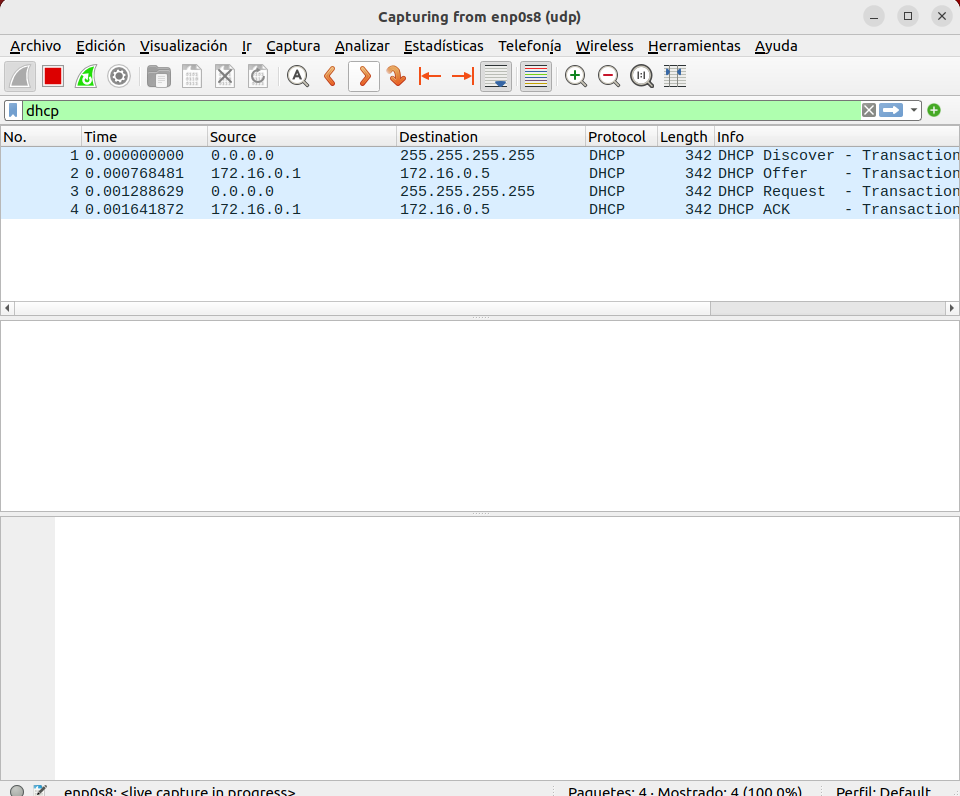

# Ubuntu DHCP Server
## Instalación
Instalación del paquete `isc-dhcp-server`:
```console
sudo apt install isc-dhcp-server
```
## Configuración
### Paso 1
Primeramente, procederemos a establecer las 2
interfaces de red de nuestro `Ubuntu Server`, configurando una interfaz `enp0s3` con dirección IP `dinámica` (mediante DHCP) y una interfaz `enp0s8` con dirección IP `estática` `172.16.0.1` con máscara de subred 255.255.0.0. Además, también especificaremos las direcciones IP de los servidores de resolución de nombres de dominio, en este caso los de Google, `8.8.8.8` y `8.8.4.4`:
```console
sudo nano /etc/netplan/00-install-config.yaml
```
*00-install-config.yaml*


### Paso 2
Cuando establezcamos la configuración de nuestras interfaces de red del servidor DHCP, procederemos a aplicarla mediante el comando:
```console
sudo netplan apply
```
A continuación, comprobamos que la configuración se ha aplicado correctamente verificando los valores de nuestras interfaces de red con el comando:
```yaml
ip a
```

### Paso 3
Ahora, procederemos a configurar nuestro servicio DHCP. Para ello, mediante
el comando:
```console
sudo nano /etc/default/isc-dhcp-server
```
entraremos al archivo `isc-dhcp-server` y pondremos la interfaz de red por la cual
se daran las direcciones IP a nuestros clientes DHCP, en este caso la interfaz `enp0s8`:

*isc-dhcp-server*
```yaml
# Defaults for isc-dhcp-server (sourced by /etc/init.d/isc-dhcp-server)

# Path to dhcpd's config file (default: /etc/dhcp/dhcpd.conf).
#DHCPDv4_CONF=/etc/dhcp/dhcpd.conf
#DHCPDv6_CONF=/etc/dhcp/dhcpd6.conf

# Path to dhcpd's PID file (default: /var/run/dhcpd.pid).
#DHCPDv4_PID=/var/run/dhcpd.pid
#DHCPDv6_PID=/var/run/dhcpd6.pid

# Additional options to start dhcpd with.
#	Don't use options -cf or -pf here; use DHCPD_CONF/ DHCPD_PID instead
#OPTIONS=""

# On what interfaces should the DHCP server (dhcpd) serve DHCP requests?
#	Separate multiple interfaces with spaces, e.g. "eth0 eth1".
INTERFACESv4="enp0s8"
INTERFACESv6=""
```
### Paso 4
Después, mediante el comando:
```console
sudo nano /etc/dhcp/dhcpd.conf
```
accederemos al archivo `dhcpd.conf` y estableceremos la configuración de la red a la cuál pertenecerán nuestros clientes DHCP:

### Paso 5
Una vez establecida toda la configuración necesaria para el correcto funcionamiento de nuestro
servicio DHCP, lo reiniciaremos mediante el comando:
```yaml
sudo service isc-dhcp-server restart
```
y a continuación comprobaremos su inicialización mediante el comando:
```yaml
sudo service isc-dhcp-server status
```

## Verificación
### Configuración de red
En un cliente DHCP, visualizamos su cofiguración de red con el comando:
```yaml
ip a
```

Ahora, en el cliente DHCP con una configuración estática, haremos lo mismo:

### Wireshark
Ahora, para verificar que nuestro servicio DHCP funciona correctamente, monitorizaremos el tráfico `UDP` de nuestra interfaz de red por DHCP en nuestro client DHCP. Para ello, mediante el comando:
```console
sudo dhclient -r
```
liberaremos nuestra dirección IP por DHCP obtenida con anterioridad.

Despues de esto pondremos los filtros para captar los paquetes de DHPC de nuestra red y haremos el siguiente comando para que nuestro equipo pida una ip al dhcp de nuevo:
```console
sudo dhclient
```
y veremos los paquetes en el wireshark

Lo mismo con el otro cliente:

En este caso se cambio la ip del 100 al 101.